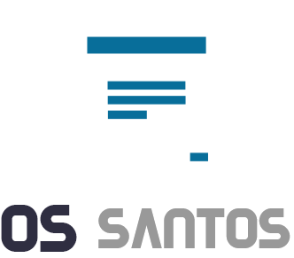
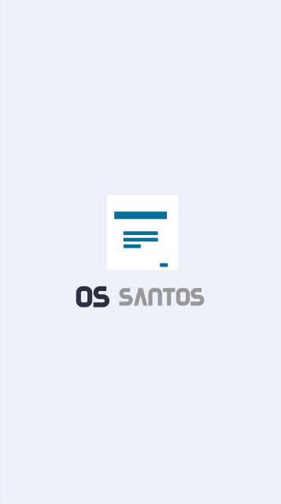
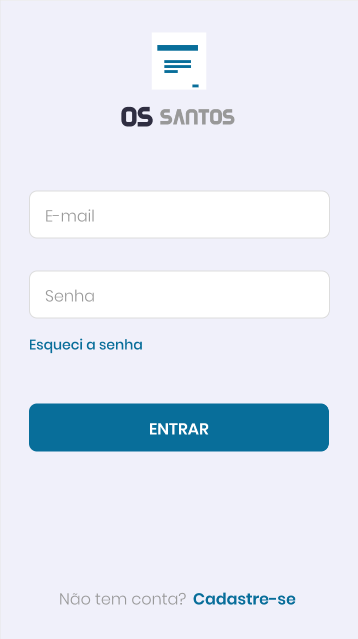
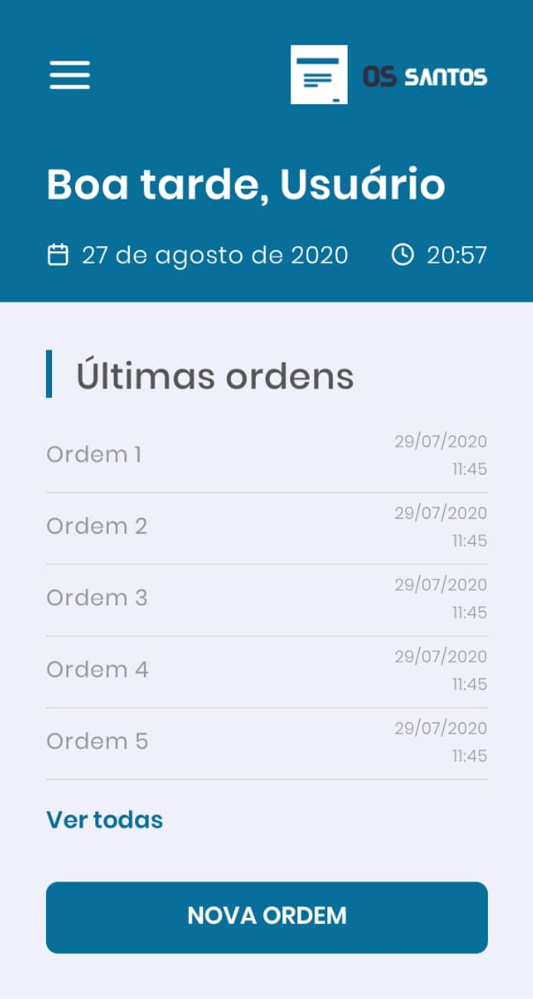

  

<h1 align="center">OS Santos</h1>

<h2 align="center">
  An application for emission of service orders 📱️
</h2>

 

  
  
  

 

  
  
  

 

  <a href="#goal">Goal</a> •
  <a href="#features">Features</a> •
  <a href="#technologies">Technologies</a> •
  <a href="#author">Author</a>

 

<h2 id="goal">🎯️ Goal</h2>

 

  The goal of OS Santos is to reduce and simplify the creation and emission of service orders

 

<h2 id="features">💻️ Features</h2>

 

- [ ] User registration
- [ ] User authentication
- [ ] Orders list
- [ ] Order creation
- [ ] Digital signature
- [ ] Order emission
- [ ] Share order

 

<h2 id="technologies">🛠 Technologies</h2>

 

The following tools were used in the development of the project:

- [React](https://pt-br.reactjs.org/)
- [React Native](https://reactnative.dev/)
- [Expo](https://expo.io/)

 

<h2 id="author">✏️️ Author</h2>

 

<a>
  
   
  <strong>Lucas Santos</strong>
</a>

 

Get in touch!

<h4 align="center">
🚧  OS Santos 📱️ In development...  🚧
</h4>
